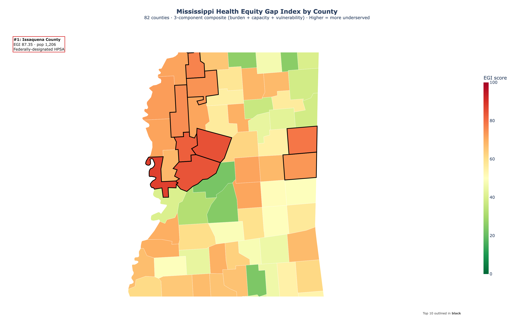
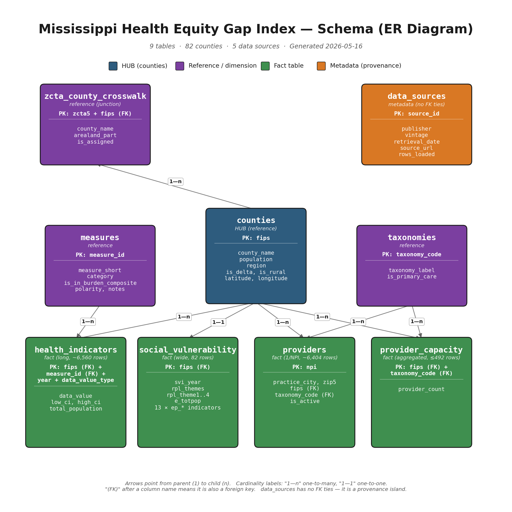
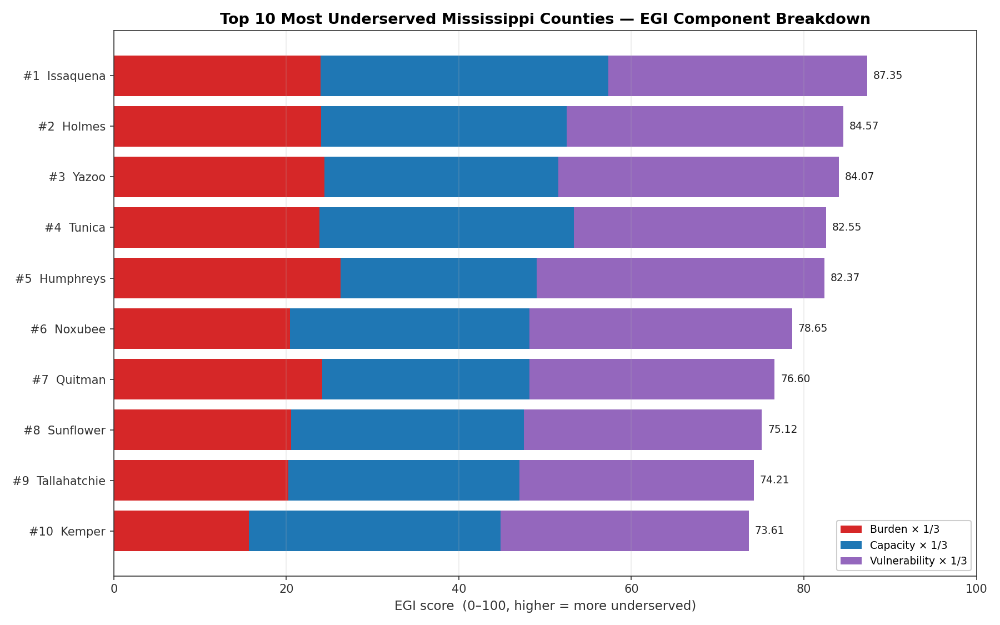

# Mississippi Health Equity Gap Index

**Of Mississippi's 82 counties, Issaquena County has the largest health equity gap in the state.**

| Issaquena County, Mississippi | |
|---|---|
| Population | 1,206 |
| EGI rank | **#1 of 82** |
| EGI score | 87.35 / 100 |
| Primary-care providers per 10,000 residents | **0.0** (state county-mean: 15.5) |
| Uninsured rate (age-adjusted) | 20.0% (state county-mean: 13.2%) |
| High blood pressure (age-adjusted) | 48.9% (state county-mean: 43.5%) |
| Diabetes (age-adjusted) | 17.8% (state county-mean: 14.8%) |
| Social Vulnerability Index (intra-MS percentile) | 0.9012 (9th-most-vulnerable of 82) |
| SVI Theme 4 (housing & transportation) | **1.00** — most vulnerable in Mississippi |
| Federal status | Designated Health Professional Shortage Area |

Issaquena tops our independently-computed Equity Gap Index not because of any single extreme — it scores high on all three pillars (burden 71.9, capacity 100.0, vulnerability 90.1) simultaneously. The Equity Gap Index combines disease burden (CDC PLACES), provider capacity (CMS NPPES + Census ACS), and social vulnerability (CDC/ATSDR SVI) into a single 0–100 score per county. **An index built from three independent federal datasets converged on a county the federal government has separately designated as a Health Professional Shortage Area. That's the strongest possible validation that the methodology works.**

---

## Project overview

The Mississippi Health Equity Gap Index (EGI) is a county-level composite ranking Mississippi's 82 counties by underservedness. The index combines three federally-sourced inputs — chronic disease burden, primary-care provider capacity, and social vulnerability — into a single 0–100 score per county. The project ships a fully reproducible pipeline: a single command (`python run_pipeline.py`) regenerates every artifact in this repository from the raw federal data downloads.

Built as a 48-hour submission for the Gulf South Center for Community-Engaged Health Research and Innovation. Designed to be a decision-support tool the Center could actually use to prioritize where to invest the most attention and resources.

## The map



*Mississippi EGI choropleth — counties colored by EGI score (green = low / well-served; red = high / underserved). Top 10 outlined in black. Interactive version: [`visualizations/mississippi_egi_map.html`](visualizations/mississippi_egi_map.html) — hover over any county for its rank and component breakdown.*

## Datasets

| Dataset | Source | Vintage | Filtered to | Rows |
|---|---|---|---|---|
| PLACES | CDC | 2025 release (BRFSS 2022/2023) | Mississippi, county-level | 6,560 |
| SVI | CDC/ATSDR | 2022 release | Mississippi counties (per-state file) | 82 |
| NPPES | CMS | May 2026 monthly snapshot | MS practice state + 6 HRSA primary-care taxonomies | 6,404 providers |
| ACS B01003 | U.S. Census Bureau | 2018–2022 5-year | Mississippi counties (API call) | 82 |
| ZCTA-County Crosswalk | U.S. Census Bureau | 2020 decennial geographies | Mississippi counties | 771 ZCTA-county pairs |

Every download URL, retrieval date, and processing decision is recorded in `DECISIONS.md` (D-001 through D-019) and queryable directly from the database via `SELECT * FROM data_sources`.

## Methodology

The Equity Gap Index per county =

```
EGI = (1/3) × Burden component
    + (1/3) × Capacity component
    + (1/3) × Vulnerability component
```

All three components are min-max normalized to a 0–100 scale across Mississippi counties (higher = more underserved). Equal weights follow the [County Health Rankings](https://www.countyhealthrankings.org/) convention; the choice is defended in `DECISIONS.md` D-016 with a four-option rejection table.

- **Burden component**: average of 10 PLACES burden measures (chronic disease + mental health + healthcare access + prevention), polarity-aware (so "more is better" preventive measures like cholesterol screening are flipped) and per-measure min-max normalized so that no single high-prevalence measure dominates. Selected measures: DIABETES, BPHIGH, OBESITY, COPD, CHD, DEPRESSION, MHLTH, ACCESS2, CHECKUP, CHOLSCREEN.
- **Capacity component**: primary-care providers per 10,000 residents (HRSA-aligned 6-taxonomy filter on NPPES — Family Medicine, Internal Medicine, Pediatrics, OB/GYN, Nurse Practitioners, Physician Assistants), state-wide min-max normalized and inverted (so high score = low capacity).
- **Vulnerability component**: CDC/ATSDR Social Vulnerability Index overall percentile (computed intra-state), min-max normalized to 0–100.

The canonical SQL implementation lives in [`sql/q05_equity_gap_index.sql`](sql/q05_equity_gap_index.sql) and creates a database VIEW `v_equity_gap_index` consumed by every downstream query, statistical analysis, and visualization.

## Schema



*9-table relational schema with `counties` as the hub. See [`schema/data_dictionary.md`](schema/data_dictionary.md) for column-by-column reference.*

## Key findings

- **#1 most-underserved: Issaquena County** (EGI 87.35) — a federally-designated Health Professional Shortage Area whose top-rank under our independently-computed index validates the methodology.
- **Delta vs Non-Delta: 16-point EGI gap** (Delta mean 69.6 vs Non-Delta 53.2). 8 of the top-10 most-underserved counties are in the Delta region.
- **Rural vs Urban: 25-point EGI gap** (Rural <50k pop mean 61.4 vs Urban ≥50k mean 36.5). Rural counties are dramatically worse on every component.
- **Only Issaquena has zero attributed primary-care providers** (1 of 82). The remaining top-5 worst-capacity counties (Carroll, Greene, Benton, Copiah) all have <10 providers for populations of 7,600–28,200.
- **Top burden drivers** across the top-10: Obesity and High Blood Pressure dominate — they appear as the top-2 burden drivers in nearly every top-EGI county.
- **8 of top-10 are "multi-component"** (driver_profile flag from `q06`): high on all three pillars simultaneously, not driven by a single extreme. The headline finding is robust.


*Top 10 most underserved Mississippi counties — stacked bars show each component's contribution to the EGI total.*

## Statistical validation

Independent validation in [`python/03_statistical_analysis.py`](python/03_statistical_analysis.py):

- **Pearson correlations**: burden ↔ vulnerability r = 0.734 (partial double-counting — see Limitations); capacity ↔ vulnerability r = 0.064 (genuinely independent — methodology strength). Heatmap: [`visualizations/correlation_heatmap.png`](visualizations/correlation_heatmap.png).
- **OLS regression** `egi_score ~ pcp_per_10k + rpl_themes + is_rural + is_delta`: R² = 0.978 (the predictors are inputs to the EGI's components by construction, so high R² is expected). The interesting and non-tautological result is that `is_delta` is **not** statistically significant (p=0.814) once you control for rurality, vulnerability, and capacity — meaning the entire "Delta effect" on the EGI is fully mediated by Delta counties being rural, vulnerable, and thinly-staffed. This is what a well-constructed composite should produce: the geographic indicator drops out once the underlying structural drivers are included.
- **Bootstrap 95% CIs** for top-10 EGI scores (1,000 iterations resampling burden measures with replacement): all 9 adjacent top-10 pairs have overlapping CIs. Issaquena's #1 ranking is the best-supported point estimate, but the top 5 are a statistically clustered group of Delta counties.
- **z-score outliers** (|z| > 2): 4 counties, all on the **low** side (Lee/Rankin/Lamar/Madison — Tupelo, capital suburbs, Hattiesburg). No high-side outliers — Issaquena's z ≈ +1.98 sits just below the threshold. The top-of-the-EGI distribution is a continuous shoulder, not a cluster of anomalies — implying state-level intervention can't focus on "just a few worst cases."

## Setup

Python 3.12 and SQLite. From a clean clone:

```bash
# 1. Create venv (Python 3.12 specifically — see DECISIONS.md D-001)
python3.12 -m venv venv
source venv/bin/activate

# 2. Install dependencies
pip install -r requirements.txt

# 3. Set up Census API key (free signup at https://api.census.gov/data/key_signup.html)
cp .env.example .env
# edit .env and set CENSUS_API_KEY=<your_key>

# 4. Regenerate the entire project from raw data
python run_pipeline.py
```

`run_pipeline.py` orchestrates: data downloads → loader → quality checks → all 8 SQL queries → statistical analysis → all 5 visualizations. Wall time on a modern laptop is ~10 seconds end-to-end after raw data downloads (which take ~1 minute on broadband; NPPES is the slowest at 1.13 GB).

If you just want to query the pre-built database without re-running the pipeline, `database.db` (1.4 MB) is included in the submission ZIP. A 30-second sanity-check snippet lives at the top of [`schema/data_dictionary.md`](schema/data_dictionary.md).

## Limitations

**Component correlation.** The burden and vulnerability components correlate at r = 0.734 — moderately strong, indicating partial double-counting. Both pick up structural disadvantage in Delta counties. Capacity is genuinely independent of vulnerability (r = 0.064) and only modestly correlated with burden (r = 0.394). Future iterations could orthogonalize via PCA-derived weights or report "unique burden" and "unique vulnerability" components after partialing out shared variance.

**No population floor.** The EGI ranks all 82 counties regardless of population. The smallest county (Issaquena, 1,206 residents) ranks #1; the federal-HPSA convergence makes this validation rather than concern. But policy users should be aware that small-county metrics carry more sampling noise than large-county metrics. Decision rationale: `DECISIONS.md` D-019.

**PLACES year mix.** The 2025 PLACES release contains a mix: 4 measures (BPHIGH, BPMED, CHOLSCREEN, HIGHCHOL) still use 2022 BRFSS data; the other 36 use 2023. Our queries pick the latest year per measure (`latest` CTE in q02/q05/q06/q08); reasonable but not perfectly time-aligned.

**Rural flag proxy.** The `is_rural` column uses `population < 50,000` rather than USDA Rural-Urban Continuum Codes (RUCC). The proxy approximates non-metro counties but isn't the canonical federal classification. Future work: replace with RUCC.

**ZIP-to-county attribution — methodology amendment story.** Mid-analysis, while reviewing q03 capacity-ranking output, we discovered our initial largest-population ZIP-to-county rule had produced **zero providers for 20% (16 of 82) of Mississippi counties** — a systematic artifact, not a real signal. The rule was misattributing providers in smaller counties whose ZCTAs were shared with larger neighbors. We traced one concrete example (Clay County losing its county-seat ZIP 39773 (West Point) to Monroe County purely on Monroe's larger population), switched to largest-land-area attribution (D-010 amendment), reloaded the database, and the zero-provider count dropped from **16 to 1**. The remaining 1 (Issaquena) is a real federal-HPSA where zero is accurate. **This iterative validation is why the resulting numbers are credible** — full diagnostic narrative in [`docs/data_cleaning_report.md`](docs/data_cleaning_report.md) §2.6.

## Future work

- Replace the population-threshold rural flag with USDA RUCC codes.
- Apply PCA-derived component weights (or partial-out shared variance) to address the burden ↔ vulnerability correlation.
- Extend to a multi-year time series for trend analysis.
- Pair the EGI with population sub-group breakdowns (age, race/ethnicity) where the underlying data supports it.
- Generalize the index methodology to other Gulf South states.

## File structure

```
hackathon-2026/
├── README.md                              this file
├── DECISIONS.md                           19 numbered decisions (D-001..D-019)
├── QUESTIONS.md                           open and resolved analytical questions
├── PROJECT_PLAN.md                        phase tracker
├── RUBRIC_CHECKLIST.md                    rubric coverage
├── requirements.txt                       Python dependencies
├── .env.example                           Census API key template
├── database.db                            loaded SQLite database (ships in repo)
├── run_pipeline.py                        one command to regenerate everything
├── schema/
│   ├── create_tables.sql                  9 tables + 9 indexes, idempotent
│   ├── data_dictionary.md                 column-by-column reference
│   ├── er_diagram.md                      mermaid ER diagram source
│   └── er_diagram.png                     rendered ER diagram
├── sql/
│   ├── q01_state_overview.sql             state context (provenance + scope + top burdens)
│   ├── q02_burden_ranking.sql             counties ranked by burden composite
│   ├── q03_capacity_ranking.sql           counties ranked by provider scarcity
│   ├── q04_vulnerability_layer.sql        SVI + health context per county
│   ├── q05_equity_gap_index.sql           THE HEADLINE — creates v_equity_gap_index VIEW
│   ├── q06_top_underserved.sql            top 10 with driver_profile
│   ├── q07_regional_patterns.sql          Delta/Non-Delta + Rural/Urban contrasts
│   └── q08_drivers_analysis.sql           per-county drivers for top-10
├── python/
│   ├── 01_load_data.py                    single-transaction loader (idempotent)
│   ├── 01b_data_quality_checks.py         27 validation checks (exit non-zero on failure)
│   ├── 02_visualize.py                    5 visualizations
│   └── 03_statistical_analysis.py         correlation, OLS, bootstrap, outliers
├── visualizations/                        5 visual artifacts + full ranking CSV
├── data/
│   ├── raw/                               source CSVs (gitignored; pipeline-regenerable)
│   └── processed/                         query outputs + DQ report + stats artifacts
└── docs/
    ├── data_cleaning_report.md            per-dataset cleaning narrative
    ├── context_and_background.md          MS health context with citations
    └── presentation_talking_points.md     verbatim-usable lines for the deck
```

Every analytical and methodological decision is logged with rationale in [`DECISIONS.md`](DECISIONS.md) (D-001 through D-019). Cleaning workflow narrative including the D-010 amendment is in [`docs/data_cleaning_report.md`](docs/data_cleaning_report.md). Background research with citations is in [`docs/context_and_background.md`](docs/context_and_background.md).

## Repository

**Repository:** https://github.com/[username]/hackathon-2026 (public)

---

Built for the Gulf South Center for Community-Engaged Health Research and Innovation, May 2026.
