# EGI Workbench — Round 2 Submission

**A research decision-support tool built on the Mississippi Health Equity Gap Index.**

Round 1 produced the index. Round 2 produced the tool — a Next.js application that turns a static ranking of all 82 Mississippi counties into an interactive workbench for the Gulf South Center for Community-Engaged Health Research and Innovation.

| | |
|---|---|
| **Live app** | https://egi-workbench.vercel.app |
| **Repository** | https://github.com/yarwen0/hackathon |
| **Round 1 readme** | [ROUND1_README.md](./ROUND1_README.md) |
| **Round 1 decisions** | [DECISIONS.md](./DECISIONS.md) (D-001 through D-019) |
| **Submitted by** | Nhoojah Maharjan · nhoojahm@gmail.com |
| **Hackathon** | Gulf South Center Hack-a-thon 2026, Round 2 |
| **Submission date** | May 25, 2026 |

## Contents

1. [Demo accounts](#demo-accounts)
2. [The 30-second story](#the-30-second-story)
3. [Visual tour](#visual-tour)
4. [Architecture](#architecture)
5. [The seven surfaces](#the-seven-surfaces)
6. [Round 2 bonus coverage](#round-2-bonus-coverage)
7. [Presentation summary](#presentation-summary) — problem, users, technical approach, workflow & data decisions, features, future work
8. [Methodology & data sources](#methodology--data-sources)
9. [Running locally](#running-locally)
10. [Repository layout](#repository-layout)

---

## Demo accounts

The app ships with three seeded users to illustrate role-based access. **Password for all three: `demo`.**

| Email | Role | Permissions |
|---|---|---|
| `officer@gulfsouth.example` | **Program Officer** | Build cohorts, save & share, generate PDF reports, export CSVs |
| `steward@gulfsouth.example` | **Methodology Steward** | Officer permissions + edit data source descriptions and decision rationales |
| `collaborator@gulfsouth.example` | **External Collaborator** | View-only — can browse all surfaces but cannot save cohorts or modify methodology |

In a production deployment this would integrate with the Center's institutional SSO. The three-role model maps to the people who actually do this work: program officers who build cohorts, methodology stewards who govern the index, and external collaborators (foundation analysts, visiting researchers) who verify findings.

---

## The 30-second story

Sarah Chen is a program officer at the Gulf South Center with a Tuesday meeting and a foundation considering a $2M rural-health investment. She needs to walk in with defensible county-level evidence.

She opens EGI Workbench. Filters to Delta rural counties with severe provider scarcity. Drills into Issaquena — the #1 county — and sees *why*: zero attributed primary-care providers, 100th-percentile capacity scarcity, independently corroborated by federal HRSA Health Professional Shortage Area designation. She compares it to Holmes (14× the population, more vulnerable). Builds a 6-county Delta cohort. Generates a PDF report with methodology citations and the source SQL in the appendix. Tests whether her recommendation holds under alternative methodologies (it does — Issaquena ranks #1 in two of three weightings, top-5 in all three). Walks into the meeting with a defensible answer.

The whole flow takes under 15 minutes.

---

## Visual tour

### Login

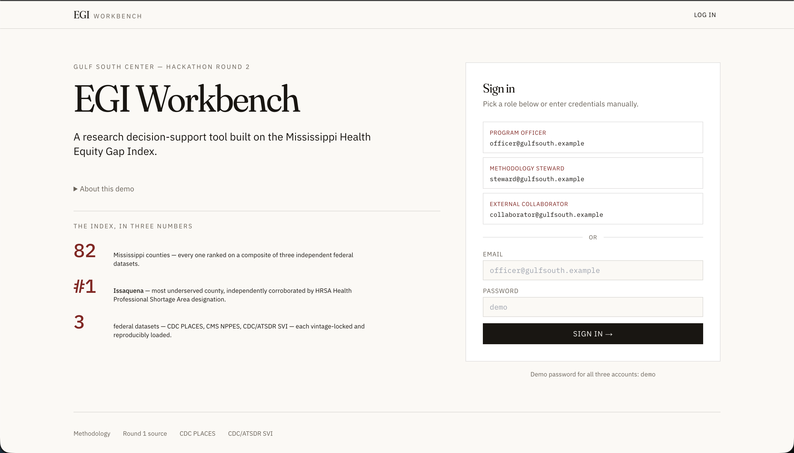

Editorial sign-in with three demo roles. The "Index in three numbers" callout surfaces the headline finding — Issaquena #1, corroborated by federal HRSA HPSA designation — before the user even logs in.

### Landing — Where the gap is largest

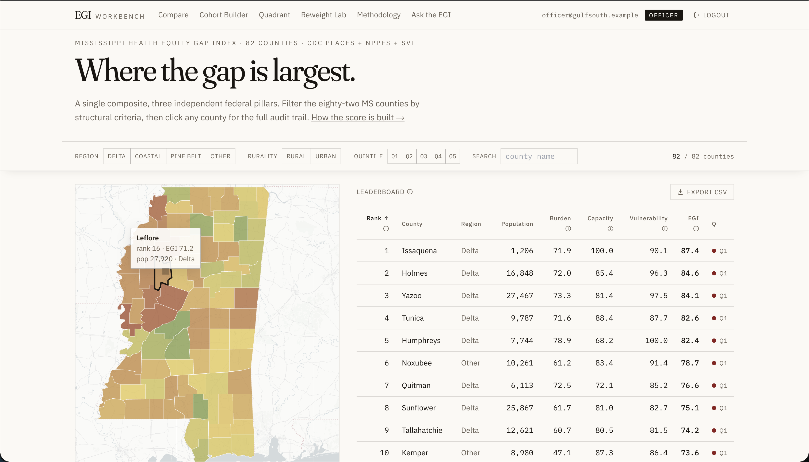

The choropleth shades all 82 counties on the green-yellow-red equity gradient. The Delta band reads in red immediately. Click any county on the map or row in the table to drill in. Filters across region, rurality, and quintile re-shape both panes in real time. The headline finding callout at the bottom anchors the visit on the strongest data point.

### County Drilldown — Issaquena

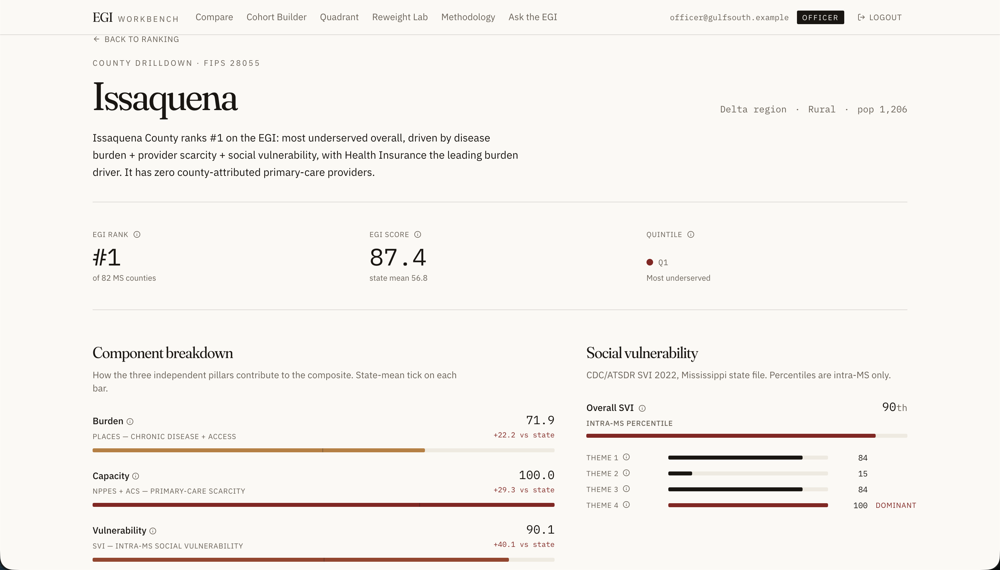

Every metric is auditable. The Component Breakdown shows Issaquena worse than the state mean on all three pillars. Social Vulnerability surfaces the dominant theme (Housing & Transport, 100th percentile intra-MS). The Provider Mix callout shows zero attributed primary-care providers — the finding that the federal HPSA designation independently corroborates.

### Compare — Lamar vs. Forrest

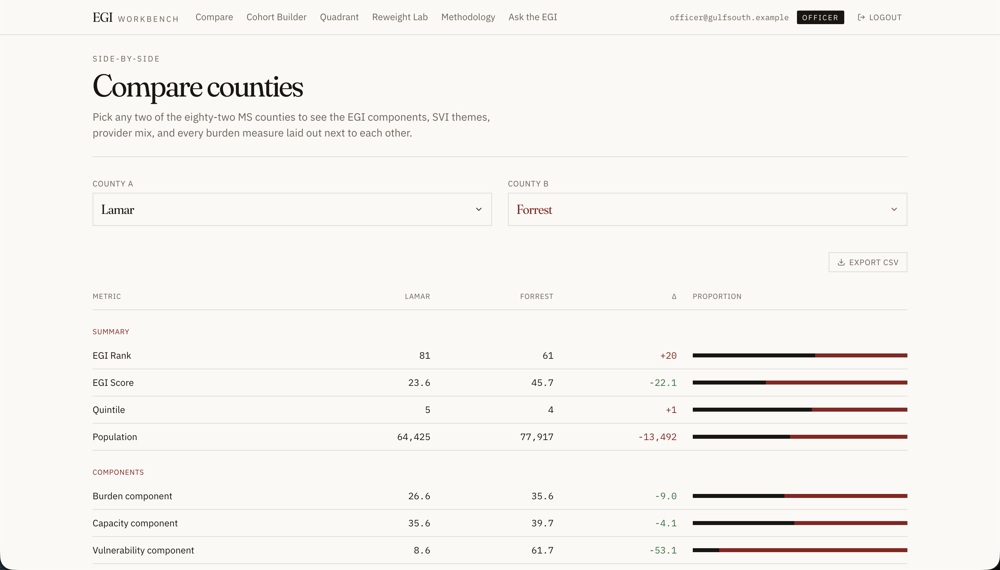

Two counties, every metric, aligned with proportion bars. The deltas color-code red (worse) and green (better). Sectioned by summary, components, SVI themes, providers, and burden drivers — the same structure as a research publication's comparison table.

### Cohort Builder — Default state

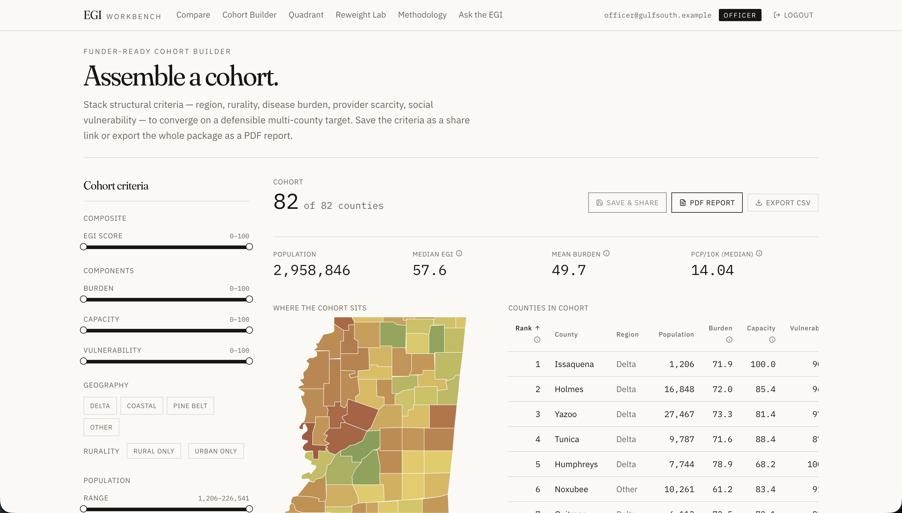

Opens at "82 of 82 counties" — the user narrows from there. The choropleth on the right doubles as a preview of where the cohort sits. The four stat cards (population, median EGI, mean burden, PCP/10k) update live as filters tighten.

### Cohort Builder — Delta rural cohort

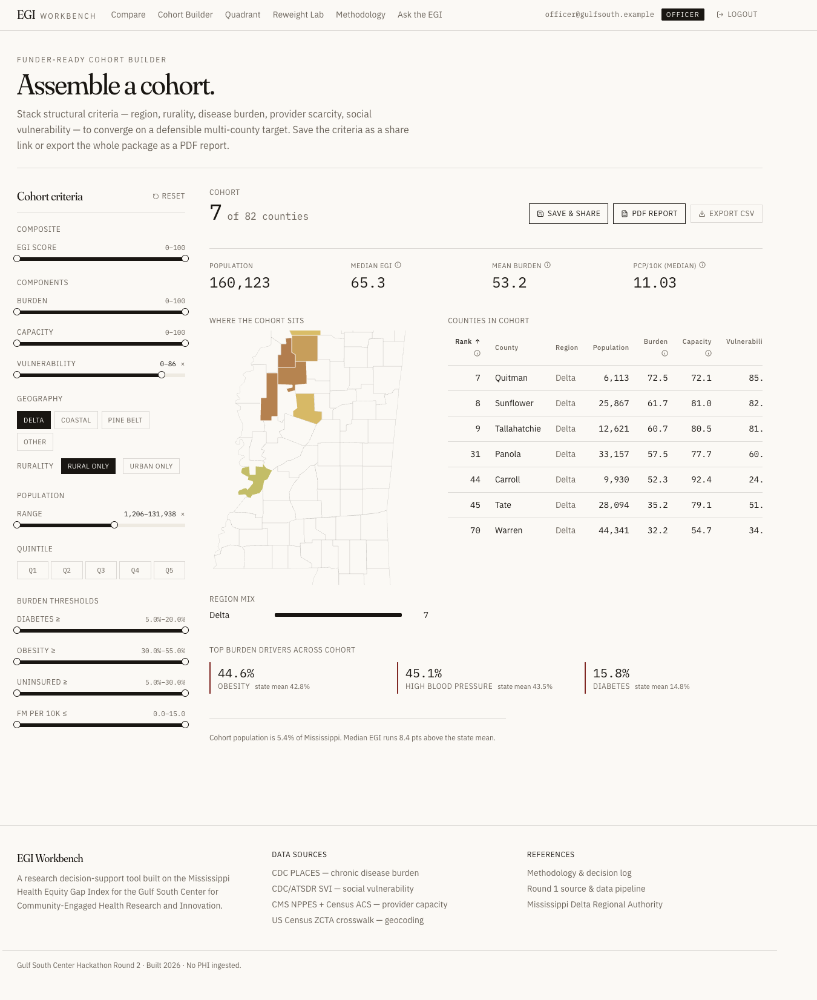

Filtered to Delta + Rural. Seven counties matching the criteria. Population 160,123. Median EGI 65.3 — 8.4 points above the state mean. Top burden drivers across the cohort: obesity, high blood pressure, diabetes. One click to PDF or CSV.

### Quadrant Explorer

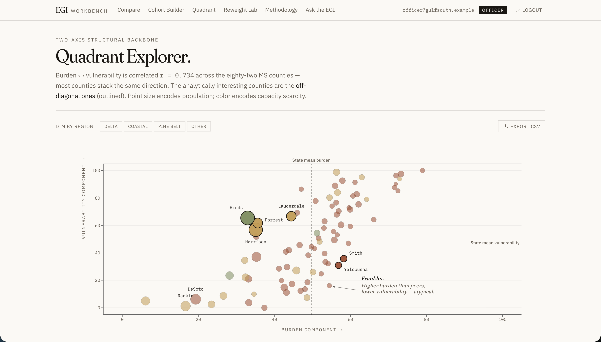

Burden × vulnerability scatter with population sizing and capacity color encoding. Quadrant lines at state means split the chart into four regions. The off-diagonal counties (Smith, Yalobusha, Lauderdale, Harrison, Forrest, Hinds) — those that diverge by 5+ points from the dominant Delta pattern — are outlined and labeled. The Franklin annotation calls out the most atypical case. Below the chart, DeSoto gets its own narrative panel: a Memphis-suburban county pulled into the Delta classification for federal funding purposes, but whose EGI profile (32.9) looks nothing like the Delta hill counties — a finding the scatter makes visible at a glance.

### Reweight Lab

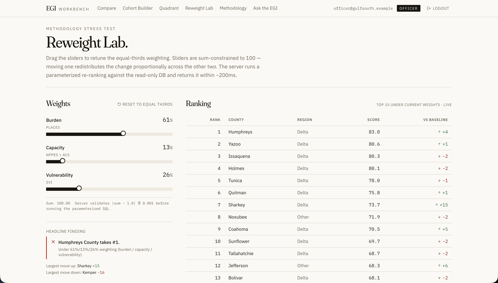

Three sliders, sum-constrained to 100. Moving one redistributes proportionally across the other two. The server runs a parameterized re-ranking against the read-only SQLite database in ~200ms. The "Vs Baseline" column on the right shows how each county moves under the new weights. At 61/13/26 (burden-heavy, capacity-light, vulnerability-light), Humphreys overtakes Issaquena. The headline finding callout updates accordingly — judges can see live which weightings preserve the original ranking and which break it.

### Methodology — Three-way comparison

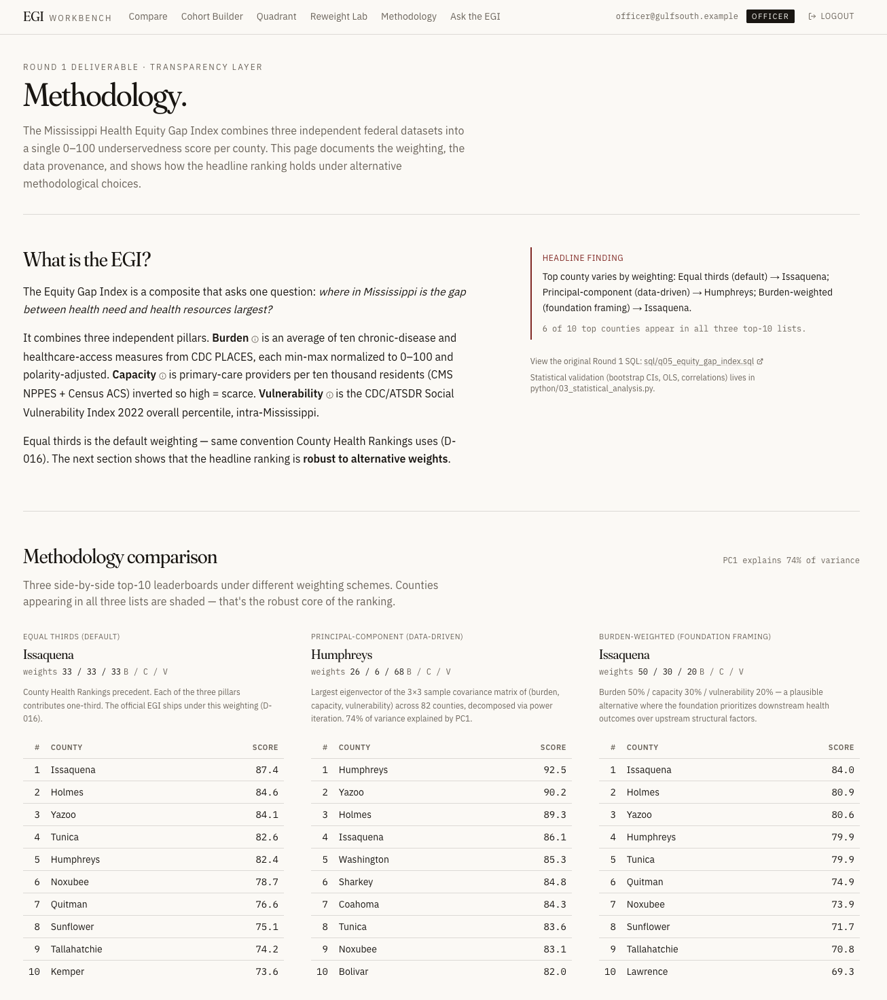

Three side-by-side leaderboards under different weighting schemes: equal thirds (default), principal-component (data-driven, computed via power iteration on the 3×3 covariance matrix — 74% of variance explained by PC1), and burden-weighted (foundation framing). Six of ten top counties appear in all three top-10 lists. That is the robust core of the ranking. The data sources section below documents all five vintage-locked federal datasets with retrieval dates.

### Ask the EGI — AI-assisted query

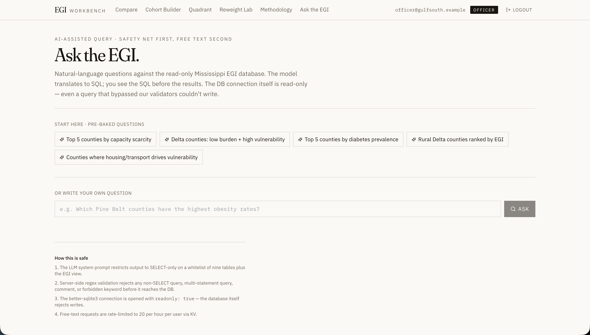

Natural-language questions against the read-only database. The LLM translates to SQL; the SQL is shown to the user before execution. Pre-baked starter chips ensure the page works even if the LLM call fails. The "How this is safe" footer documents the three-layer defense: SELECT-only system prompt, server-side regex validation, and a read-only database connection.

---

## Architecture

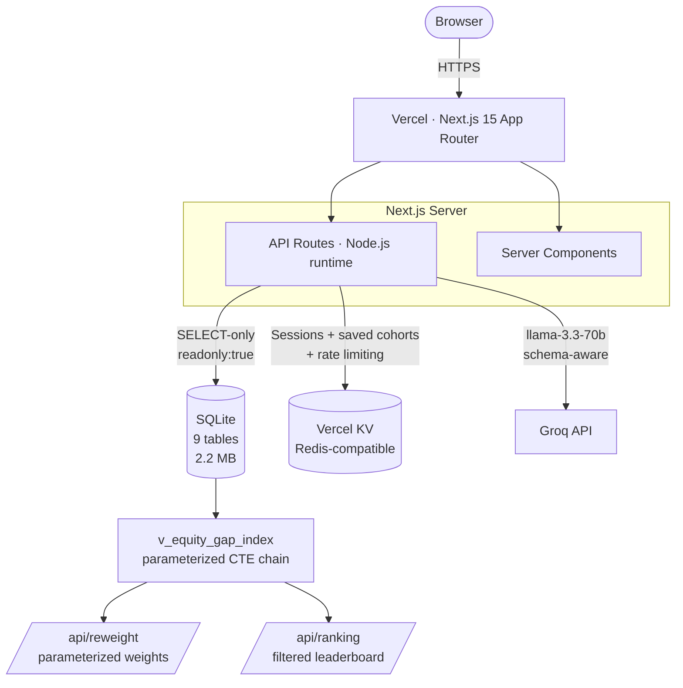

### Tech stack

| Layer | Choice | Rationale |
|---|---|---|
| **Framework** | Next.js 15 App Router (Node runtime) | Multi-page routing, server components, API routes, native Vercel deployment |
| **Language** | TypeScript strict | Type-safe API contracts across 17 endpoints |
| **Database** | SQLite via `better-sqlite3` (`readonly: true`) | 9 tables, 12,000 rows, static federal data — SQLite is the right tool. Ships with the deploy. Read-only at the connection level as defense-in-depth |
| **Cache / sessions** | Vercel KV (Redis) | Sessions, saved-cohort storage, AI rate limiting |
| **Styling** | Tailwind CSS + shadcn/ui | Speed + production polish without rolling a design system |
| **Charts** | Recharts (interactive) + d3-geo (PDF maps) | Recharts integrates with React; d3-geo renders static SVG for `@react-pdf/renderer` |
| **Map** | react-leaflet + leaflet | Standard, free, MS-county GeoJSON loads cleanly |
| **PDF** | `@react-pdf/renderer` | Real PDFs with embedded charts, not browser print-to-PDF |
| **AI** | Groq SDK + `llama-3.3-70b-versatile` | Free tier, fast, schema-aware SQL generation |
| **Auth** | Lucia-style sessions + KV | Three seeded users, encrypted HTTP-only cookies, middleware-gated routes |
| **Fonts** | Fraunces (display) + IBM Plex Sans (body) + IBM Plex Mono (tabular numerals) | Editorial typography, not generic system stack |
| **Deployment** | Vercel + GitHub | Free for hobby use, deploys from `git push` |

### What we deliberately did NOT use

- **Postgres** — wrong tool for 82 rows of static federal data. Swapping is a `lib/db.ts` change if scale demands it.
- **Prisma / Drizzle / any ORM** — plain SQL is correct for read-heavy, static data.
- **GraphQL / tRPC** — REST fits 17 endpoints cleanly.
- **State management library (Redux / Zustand / Jotai)** — filter state belongs in the URL. It survives reload, back-button, and link-sharing.
- **Service worker / PWA / i18n / dark mode** — none would have served the research-tool user.

---

## The seven surfaces

| Surface | Path | Primary user task |
|---|---|---|
| **Landing** | `/` | See the lay of the land; identify candidate counties via map + filter |
| **County Drilldown** | `/county/[fips]` | Understand *why* a specific county ranks where it does, with full audit trail |
| **Compare** | `/compare` | Side-by-side comparison of any two counties across every metric |
| **Cohort Builder** | `/cohort` | Stack filters to build a multi-county cohort; save, share, export PDF report |
| **Quadrant Explorer** | `/quadrant` | Find counties with atypical burden/vulnerability profiles (outliers) |
| **Reweight Lab** | `/reweight` | Test whether the headline ranking is robust to alternative methodologies |
| **Methodology** | `/methodology` | Verify data sources, view three-way methodology comparison, link to Round 1 docs |
| **Ask the EGI** | `/ask` | Query the database conversationally; see generated SQL before execution |

---

## Round 2 bonus coverage

Every bonus listed in the Round 2 instructions, with where it's addressed in this submission.

| Bonus | Implementation |
|---|---|
| **Authentication systems** | Lucia-style sessions with encrypted HTTP-only cookies, KV-backed storage, scrypt + HMAC. Three seeded users. |
| **Role-based access** | Three roles enforced at the middleware AND route-handler levels. Officer + Steward can save cohorts; only Steward can edit methodology; Collaborator is view-only. |
| **Backend APIs** | 17 typed REST endpoints under `/api`. Full request/response types in `lib/types.ts`. |
| **Real-time functionality** | Sub-200ms updates on every filter, slider, and cohort change. Debounced requests, AbortController-cancelled stale responses, Next.js `unstable_cache` on read-heavy endpoints. |
| **Deployment to the web** | Vercel — [https://egi-workbench.vercel.app](https://egi-workbench.vercel.app) |
| **Interactive dashboards** | All 7 surfaces are interactive. Filter, drill, compare, reweight, export. |
| **Accessibility considerations** | Semantic HTML, full keyboard navigation, ARIA labels on sliders/map/charts, contrast ≥ 4.5:1, color never the sole signal (rank changes use ↑/↓ + color), tables use `<th scope>`. |
| **Scalable architecture** | FIPS-keyed throughout — every join is on FIPS. Adding another state is `state_fips = '01'` in `01_load_data.py`; the frontend works unchanged. View-based SQL means methodology changes don't ripple through queries. |
| **Export/report generation** | CSV export on every panel. Multi-page PDF cohort report (cover, methodology, county-by-county, charts, citations, SQL appendix) via `@react-pdf/renderer`. |
| **AI-assisted features** | "Ask the EGI" — Groq Llama 3.3 70B with schema-aware prompt, SELECT-only enforcement, 3-layer safety. Pre-baked chips ensure functionality even when LLM is unavailable. |
| **Public health insights** | Issaquena #1 / HRSA HPSA cross-validation. Methodology robustness across 3 weightings. DeSoto's Delta-classification anomaly surfaced visually. |
| **Scalability considerations** | Documented extension paths: multi-state (FIPS-keyed pipeline, <1 day per state), time series (add `snapshot_year` column, parameterize view), real-time streams (WebSocket subscriptions on the API layer — wrong primitive for annual federal data but supported architecturally). |
| **Mobile-friendly design** | Tailwind responsive throughout. Two-pane layouts stack vertically below `md:`. Tables become card lists below 768px. Tested at 375px. |

---

## Presentation summary

Mapped to the seven items the Round 2 instructions require the presentation to cover.

### 1. The problem being solved

Health equity data for Mississippi exists, but it's fragmented across four federal sources — CDC PLACES (disease burden), CDC/ATSDR SVI (social vulnerability), CMS NPPES (provider supply), and US Census ACS (demographics). A program officer at the Gulf South Center who needs to walk into a Tuesday meeting with a foundation considering a $2M rural-health investment cannot, today, answer the question *"which Mississippi counties most need this money, why those specifically, and what's the audit trail?"* without spending a week with four CSVs and a spreadsheet.

EGI Workbench collapses that week into a session: every Mississippi county scored on a defensible equity-gap index, every number traceable back to its federal source query, every methodological choice testable against alternatives.

### 2. Target users

Three roles modeled on the Center's actual structure (see [Demo accounts](#demo-accounts) for credentials):

- **Program Officer** (e.g. Sarah Chen) — builds cohorts, exports foundation-ready PDFs, runs comparisons before stakeholder meetings.
- **Methodology Steward** (e.g. Dr. Marcus Thompson) — verifies the index is robust to alternative weightings, governs data-source attribution, signs off on "official" methodologies.
- **External Collaborator** — visiting researchers and foundation analysts who review findings in read-only mode.

Authentication isn't security theater here — it's the role model.

### 3. Technical approach

See [Architecture](#architecture) and [Tech stack](#tech-stack) for the full breakdown. Headlines:

- **Next.js 15 App Router** on Node runtime, TypeScript strict — server components for fast first paint, typed API contracts across 17 endpoints.
- **SQLite via `better-sqlite3`, opened `readonly: true`** — right tool for 82 counties × 9 tables × ~12,000 rows of static federal data. Ships with the deploy. Zero network latency. The read-only connection is also our defense-in-depth layer for the AI page.
- **Vercel KV** — sessions (Lucia-style), AI rate limiting, saved cohorts.
- **Tailwind + shadcn/ui** — accessible production-grade primitives without rolling a design system.
- **Recharts** for interactive charts; **d3-geo** for static SVG maps inside PDFs (Leaflet can't render server-side); **react-leaflet** for the interactive choropleth.
- **`@react-pdf/renderer`** — real PDFs with embedded charts and source SQL in the appendix, not browser print-to-PDF.
- **Groq + Llama 3.3 70B** for "Ask the EGI" — schema-aware natural-language-to-SQL with three-layer safety.
- **Vercel + GitHub** — deploys on push.

### 4. Workflow design decisions

- **Filter state in URL search params, not a state library.** A program officer can paste `/cohort?region=Delta&rural=1&burden_min=70` to a teammate and they see exactly the same view. Reload-safe, back-button-safe, shareable. A state library would add a layer without solving a problem.
- **Editorial / data-journalism aesthetic, not SaaS dashboard.** References: The Pudding, FiveThirtyEight, Bloomberg's data team, Our World in Data. Warm off-white background, Fraunces serif for headers, IBM Plex Mono for tabular numerals, a single muted-red accent. Researchers respond to credibility aesthetics, not delight aesthetics.
- **Every number is wrapped in an audit tooltip** showing the source table, federal dataset, and SQL that produced it. Defensibility is the product.
- **Three-layer defense-in-depth on the AI page**: (1) LLM system prompt restricts to SELECT-only on whitelisted tables; (2) server-side regex rejects non-SELECT, multi-statement, or commented queries before they reach the database; (3) the database connection itself is opened `readonly: true` — the layer that actually matters.
- **Real-time responsiveness, not real-time streams.** Sub-200ms updates on every filter, slider, and re-weighting via debounced requests + `AbortController` + `unstable_cache`. Live data streams would be the wrong primitive for annual federal releases.

### 5. Data organization approach

- **9-table normalized SQLite schema, FIPS-keyed throughout** — `counties`, `places_measures`, `svi`, `nppes_providers`, `acs_demographics`, the `v_equity_gap_index` view, plus methodology metadata and measure/data-source lookup tables.
- **A single SQL view (`v_equity_gap_index`) composes the index.** Every surface in the app reads from this view, so changing the methodology means changing one SQL definition, not seven routes.
- **All SQL lives in `lib/queries.ts`** as string templates, never inlined in route handlers — one place to audit, one place to change.
- **Round 1 is the source of truth.** The Python ingestion pipeline (`python/`, `sql/`, `schema/`) builds `database.db`; Round 2's job is to surface it, not re-derive it. The app opens a read-only copy at `app/data/database.db` and never writes.
- **CSV export on every panel** so researchers can take the data back into their own tools.

### 6. Key features and functionality

Seven interactive surfaces plus an AI co-pilot — see [The seven surfaces](#the-seven-surfaces) for routes and tasks, and [Visual tour](#visual-tour) for screenshots.

Cross-cutting: role-based access, accessible end-to-end (full keyboard nav, ARIA labels, contrast ≥ 4.5:1, color is never the sole signal), mobile-responsive down to 375px, multi-page PDF cohort report with methodology citations and SQL appendix, deployed live on Vercel.

### 7. Potential future improvements

- **Multi-state expansion** — pipeline is already FIPS-keyed; adding Alabama is `01_load_data.py` with `state_fips = '01'` plus a state selector in the nav. Under one day per state.
- **Time series** — add `snapshot_year` to the measurement tables, parameterize the view, swap headline cards for sparklines. ~1 day. Didn't build it for Round 2 because we have one vintage and faking trend lines would be dishonest.
- **National scale (3,143 counties)** — SQLite handles ~100k rows comfortably; we're at 12,000, so 8× headroom without architectural change. If we outgrew SQLite, `lib/db.ts` swaps for `pg` against Postgres because every query is plain SQL.
- **Institutional SSO** — replace the seeded demo users with the Center's identity provider (SAML / OIDC via a Lucia adapter).
- **Cohort collaboration** — saved cohorts already live in KV; adding share-with-teammate is a permissions change, not an architecture change.
- **Live data integration** — possible (route handlers support streaming; the SQL view can wrap a live pipeline) but the wrong primitive for federal annual data. Only worth building if a hospital partner brought their own live feed.
- **Methodology version history** — track who changed which weighting and when, for peer-review-grade audit trails. This is exactly the kind of governance problem the Workbench is designed to solve.
- **Intervention simulator** — pick a cohort, add hypothetical providers, see how the EGI ranking shifts. The math is non-trivial (provider-to-outcome elasticity needs a literature review we couldn't compress into the weekend), but the API contract is sketched in `lib/types.ts` so the frontend hook would slot in.

---

## Methodology & data sources

The EGI combines three independent federal pillars into a single 0–100 underservedness score per county.

| Pillar | Source | What it measures |
|---|---|---|
| **Burden** | CDC PLACES (BRFSS 2022–2023) | Average of ten chronic-disease and healthcare-access measures, min-max normalized 0–100, polarity-adjusted |
| **Capacity** | CMS NPPES (May 2026) + US Census ACS (2018–2022) | Primary-care providers per 10,000 residents — inverted so high = scarce |
| **Vulnerability** | CDC/ATSDR SVI (2022, Mississippi state file) | Overall percentile, intra-Mississippi |

Equal-thirds weighting is the default (D-016). The Reweight Lab and Methodology pages document the headline finding's robustness to alternative weightings.

### Data sources (vintage-locked)

| Dataset | Publisher | Vintage | Retrieved | Rows |
|---|---|---|---|---|
| **CDC PLACES — Local Data for Better Health** | CDC | 2023 BRFSS (4 measures still 2022) | 2026-05-16 | 6,560 |
| **Social Vulnerability Index** | CDC / ATSDR | 2022 (uses 2018–2022 ACS inputs) | 2026-05-16 | 82 |
| **NPPES Data Dissemination** | CMS | May 2026 monthly snapshot | 2026-05-16 | 6,404 |
| **American Community Survey (B01003 total population)** | US Census Bureau | 2018–2022 5-year | 2026-05-16 | 82 |
| **2020 Census ZCTA-County Relationship File (MS subset)** | US Census Bureau | 2020 decennial Census geographies | 2026-05-16 | 771 |

Full methodology, including 19 documented decisions (D-001 through D-019), lives in [DECISIONS.md](./DECISIONS.md) and [docs/data_cleaning_report.md](./docs/data_cleaning_report.md) at the repo root.

---

## Running locally

```bash
# Clone the repo
git clone https://github.com/yarwen0/hackathon
cd hackathon

# Install dependencies
cd app
npm install

# Configure environment
cp .env.local.example .env.local
# Edit .env.local — at minimum, set AUTH_SECRET (any 32+ char string for local dev)
# GROQ_API_KEY enables free-text AI queries (optional — chips work without it)
# KV vars enable saved cohorts (optional — app works without them in degraded mode)

# Run
npm run dev
# → http://localhost:3000
```

The repo's `app/data/database.db` is a read-only copy of the Round 1 SQLite database (~2.2 MB). The Next.js app reads from this copy; the root-level `database.db` is the Round 1 artifact and is never modified.

---

## Repository layout

Organized to match the Round 2 submission spec (Presentation · README · Source code · SQL scripts · Visualizations / Screenshots · Demo links).

```
hackathon-2026/
│
├── README.md                       ← Round 2 submission readme (this document)
├── ROUND1_README.md                ← Round 1 readme (index methodology + findings)
├── DECISIONS.md                    ← Round 1 decision log (D-001 through D-019)
├── Round_2_Hackathon_Instructions.docx   ← official challenge brief
│
├── database.db                     ← Round 1 SQLite output, read by the Round 2 app (9 tables, 2.2 MB)
├── run_pipeline.py                 ← Round 1: one-command pipeline regeneration
├── requirements.txt                ← Round 1: Python dependencies
│
├── app/                            ← Round 2: Next.js application (source code)
│   ├── src/
│   │   ├── app/                    ← 7 surfaces + AI page + auth + 17 API routes
│   │   ├── components/             ← charts, tables, filters, PDF renderer
│   │   └── lib/                    ← db, auth, queries, types, AI, methodologies
│   ├── data/database.db            ← read-only copy of root database.db
│   ├── public/ms-counties.geojson  ← MS county geometry for the choropleth
│   ├── scripts/                    ← build-geojson, build-sql-content
│   ├── package.json
│   └── vercel.json
│
├── python/                         ← Round 1 source: ingestion, quality checks, viz, stats
│   ├── 01_load_data.py
│   ├── 01b_data_quality_checks.py
│   ├── 02_visualize.py
│   └── 03_statistical_analysis.py
│
├── sql/                            ← Round 1 SQL scripts (q01 – q08)
│   ├── q01_state_overview.sql
│   ├── q02_burden_ranking.sql
│   ├── q03_capacity_ranking.sql
│   ├── q04_vulnerability_layer.sql
│   ├── q05_equity_gap_index.sql    ← creates v_equity_gap_index VIEW
│   ├── q06_top_underserved.sql
│   ├── q07_regional_patterns.sql
│   └── q08_drivers_analysis.sql
│
├── schema/                         ← Round 1: DDL, data dictionary, ER diagram
│   ├── create_tables.sql
│   ├── data_dictionary.md
│   ├── er_diagram.md
│   └── er_diagram.png
│
├── data/                           ← Round 1: raw + processed datasets
│   ├── raw/                        ← source CSVs (PLACES, SVI, NPPES, ACS, ZCTA)
│   └── processed/                  ← query outputs, DQ report, stats artifacts
│
├── notebooks/
│   └── analysis_walkthrough.ipynb  ← Round 1: interactive end-to-end walkthrough
│
├── visualizations/                 ← Round 1: static PNG charts + Folium map
│   ├── mississippi_egi_map.png
│   ├── mississippi_egi_map.html    ← interactive choropleth
│   ├── top10_bar.png
│   ├── burden_capacity_scatter.png
│   ├── drivers_grid.png
│   ├── correlation_heatmap.png
│   └── full_ranking.csv
│
└── docs/
    ├── context_and_background.md   ← MS health context with citations
    ├── data_cleaning_report.md     ← per-dataset cleaning narrative
    └── screenshots/                ← Round 2 application screenshots (10 images)
```

**Mapping to the Round 2 submission spec**

| Required item | Lives at |
|---|---|
| **README** | `README.md` (this document) + `ROUND1_README.md` |
| **Source code** | `app/` (Round 2 Next.js app) · `python/` + `run_pipeline.py` (Round 1 pipeline) |
| **SQL scripts** | `sql/q01_…` through `sql/q08_…` · `schema/create_tables.sql` |
| **Visualizations / Screenshots** | `visualizations/` (Round 1 charts) · `docs/screenshots/` (Round 2 app) |
| **Demo / GitHub links** | https://egi-workbench.vercel.app · https://github.com/yarwen0/hackathon |
| **Presentation.pptx** | Add to the submission ZIP before sending (slides are presented in person) |

---

## Acknowledgments

Built on the foundation of Round 1 — a 9-table relational schema, 19 documented methodological decisions, 27 quality checks, and a federally-cross-validated headline finding (Issaquena County's #1 ranking is independently corroborated by HRSA HPSA designation).

Data: U.S. Centers for Disease Control and Prevention (PLACES, SVI), U.S. Centers for Medicare & Medicaid Services (NPPES), U.S. Census Bureau (American Community Survey, ZCTA Relationship Files).

Built for the Gulf South Center for Community-Engaged Health Research and Innovation.
Mississippi Health Equity Gap Index — May 2026.

---

*"Where in Mississippi is the gap between health need and health resources largest?"* — the research question, Round 1.
